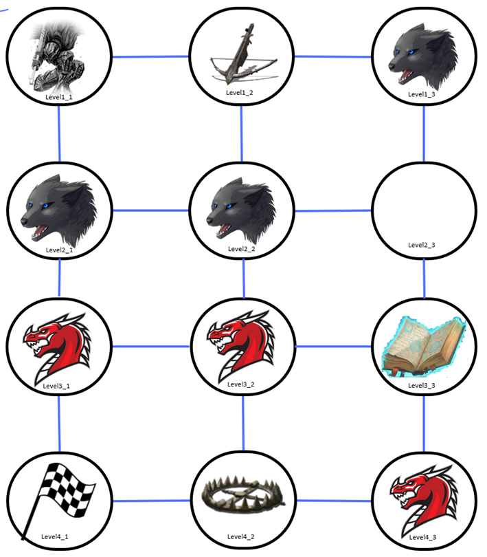
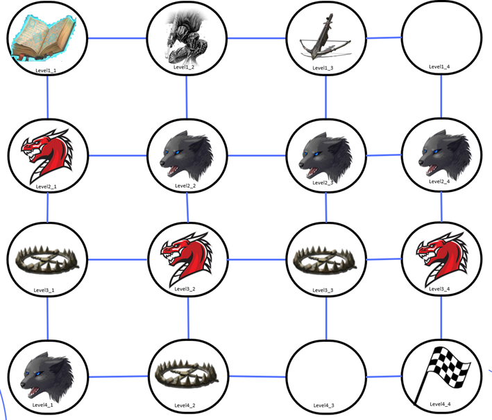

# Automated-RPG-Adventure-Planning
The fundamental purpose is the achievement of going from the initial level to the goal level, overcoming the challenges present in the different levels that make up a world within the game.

## Table of Contents

- [Project Structure](#project-structure)
- [Gaming Considerations](#gaming-considerations)
- [Examples](#examples)
- [Conclusion](#conclusion)
- [Authors](#authors)

## Project Structure
The Automated RPG Adventure Planning system is organized around the principles of automated planning. The project structure consists of two fundamental components: the domain and the problems:

### 1. Domain

The **domain** describes the general rules and dynamics of the RPG world. It defines what actions characters can take and how those actions affect the state of the world. The main elements of the domain include:

- **actions**: These are operations that characters can perform within the game, such as moving from one location to another, interacting with objects, or facing enemies. The actions are as follows:
  - **move**: This action allows the player to move only to an empty level or a level with a trap.
  - **move-equipped-with-weapon**: This action allows the player to move only to an empty level or with a beast.
  - **move-equipped-with-spell**: This action allows the player to move to a level with a dragon, empty or with a trap.
  - **disarm_trap**: This action allows a player to disarm a trap.
  - **pickup_weapon / pickup_spell**: These actions allow the player to equip himself with a weapon/spell.
  - **destroy_weapon / destroy_spell**: These actions allow the player to destroy a weapon/spell.
  
### 2. Problems

The **problems** are concrete instances of the domain that pose specific scenarios that the player must solve. Examples of problems are shown below:

- ### Problem 1
  - In this problem, the player must move from level `level1_1` to level `level4_1`, collecting weapons and spells, and facing enemies through a sequence of actions.

- ### Problem 2
  - In this case, the player starts at level `level1_2` and must reach level `level4_4`, avoiding traps and using spells to advance strategically.
 
## Gaming Considerations
In the RPG world, the player must advance through several levels facing different challenges. The following are the rules that govern this system:

1. **Player Objective**:  
   The player must move from the initial level to the final level.

2. **Elements in Each Level**:  
   Each level may contain:
   - A beast
   - A dragon
   - A trap
   - A weapon
   - A spell
   - Or it can be empty

3. **Trap Disarming**:  
   The player can disarm traps, but **only** if he does not have a weapon equipped.

4. **Equipment**:  
   The player may equip himself with:
   - A weapon
   - A spell

5. **Movement through Empty Levels**:  
   The player can move through empty levels without the need to be equipped.

6. **Level Destruction**:  
   Once the player passes through a level, **that level is destroyed**.

7. **Encounter Beasts**:  
   The player can only pass through levels with beasts if equipped with a weapon.

8. **Encounter Dragons**:  
   The player can only go through levels with dragons if equipped with a spell.

9. **World Structure**:  
   The world or map is defined as a two-dimensional matrix.

## Examples
## Problem 1
  The player must move from level `level1_1` to level `level4_1`
  
## Results
To reach the final destination it was determined that this would be the best solution:
```bash
(move level1_1 level1_2)
(pickup_weapon level1_2)
(move-equipped-with-weapon level1_2 level2_2)
(move-equipped-with-weapon level2_2 level2_3)
(move-equipped-with-weapon level2_3 level3_3)
(destroy_weapon level3_3)
(pickup_spell level3_3)
(move-equipped-with-spell level3_3 level3_2)
(move-equipped-with-spell level3_2 level3_1)
(move-equipped-with-spell level3_1 level4_1)
 ```
## Problem 2
  The player starts at level `level1_2` and must reach level `level4_4`
  
## Results
To reach the final destination it was determined that this would be the best solution:
```bash
(move level1_2 level1_1)
(pickup_spell level1_1)
(move-equipped-with-spell level1_1 level2_1)
(move-equipped-with-spell level2_1 level3_1)
(disarm_trap level3_1)
(move-equipped-with-spell level3_1 level3_2)
(move-equipped-with-spell level3_2 level3_3)
(disarm_trap level3_3)
(move-equipped-with-spell level3_3 level4_3)
(move-equipped-with-spell level4_3 level4_4)
 ```
## Authors
- 🧑‍💻 Marco Sanchez Escudero
- 🧑‍💻 Jhovany QUintana Vera
